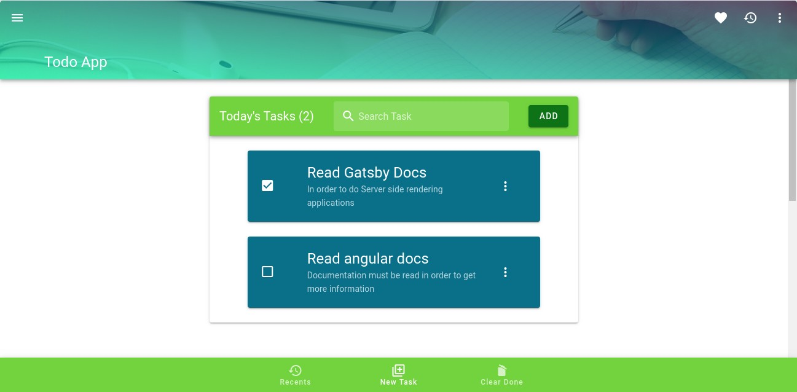

# Vue-todo-app



## Project setup
```
npm install
```

### Compiles and hot-reloads for development
```
npm run start:dev
```

### Compiles and minifies for pre-production
```
npm run build:dll
```

### Compiles and minifies for production
```
npm run build
```

### Customize configuration
See [Configuration Reference](https://cli.vuejs.org/config/).
